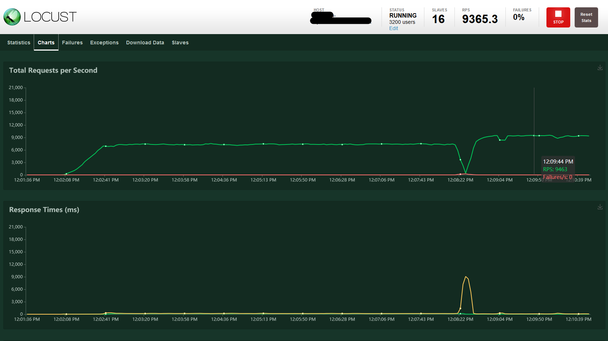

# Running Locust.io on Azure Container Instances

Running distributed Locust.io on Azure Container Instances

Article with details is here:

[Running Locust on Azure](https://dev.to/azure/running-locust-on-azure-2k40)

Or just run `azure-deploy.sh` and follow instructions. Is that easy :)

You can try it right away, even if you don't have any API you can call, using [JSONPlaceholder](https://jsonplaceholder.typicode.com). To avoid flooding JSONPlaceholder with tons of request, the default values are set to create 1 locust client that will simulate 1 user only. The user will send a GET or a POST request every 5 to 10 seconds.